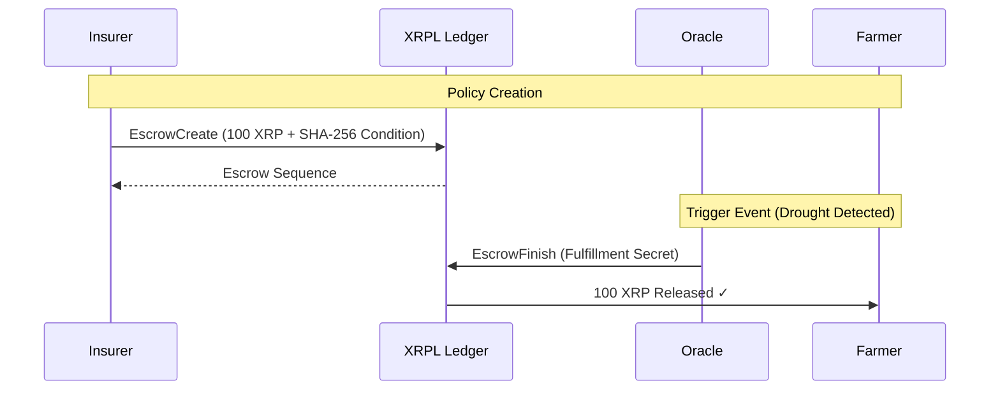
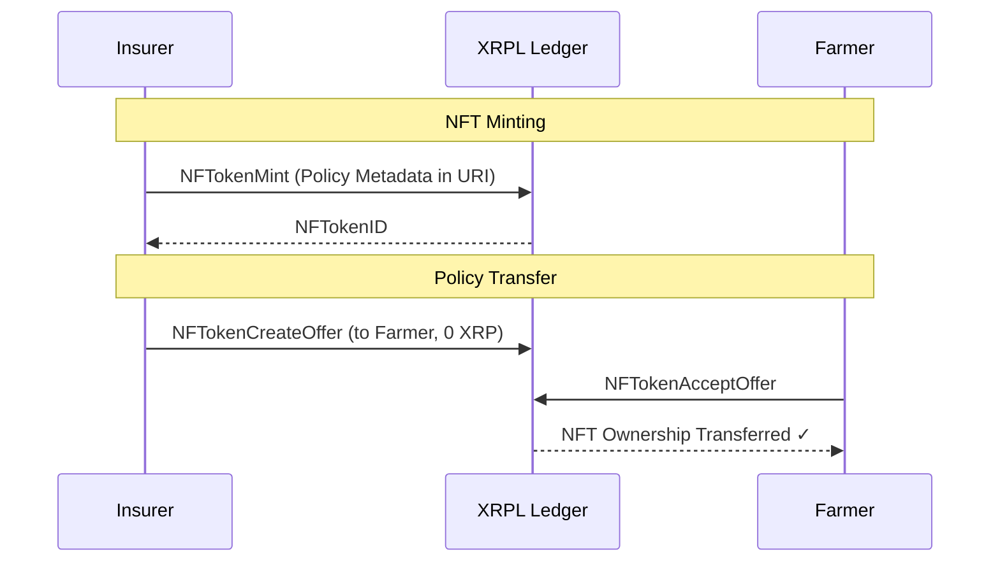
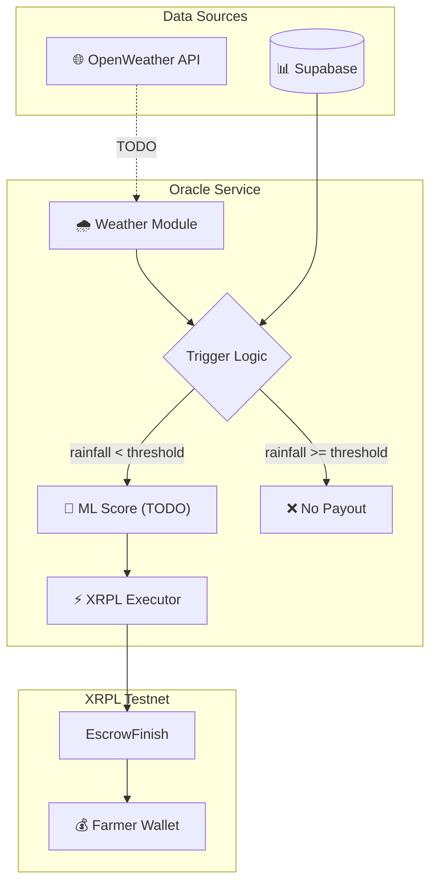
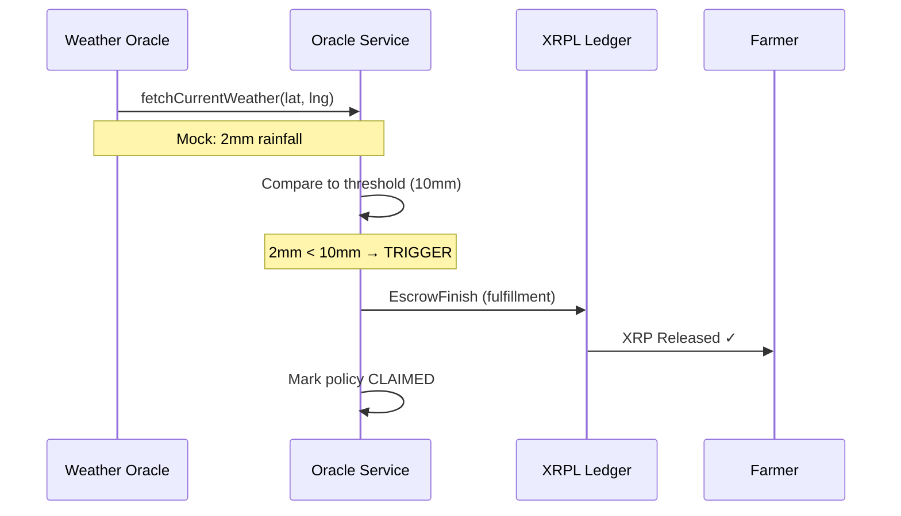

# Canopy

**Insurance That Pays Automatically.**
Canopy is a decentralized agricultural insurance platform built on the XRPL blockchain. It uses parametric triggers and real-time weather oracles to provide instant liquidity to farmers, removing claims, disputes, and delays.

## Core Features
*   **Data-Driven Triggers:** Policies activated by objective NOAA/NASA weather data.
*   **Instant Payouts:** Smart contracts on XRPL Escrow release funds immediately.
*   **Total Transparency:** Audited on-chain logic ensures guaranteed liquidity.

## Design System
*   **Theme:** Premium Startup Aesthetic (Dark Mode, Deep Forest Void, Neon Cyber Lime).
*   **Documentation:**
    *   [design.md](./design.md): Full semantic design system and Stitch prompts.
    *   [site.md](./site.md): Complete functional specification for the site and app.

## Agent Skills & Workflows
This project is equipped with specialized AI agent skills and workflows to accelerate development.

### Skills (`.agents/skills`)
Usage: These are "folders of instructions" the agent can use to perform complex tasks. 

| Skill Name | Description | When to Use |
| :--- | :--- | :--- |
| **design-md** | Analyzes Stitch projects to create a `DESIGN.md` system. | Use when you want to reverse-engineer a Stitch design into a reusable design system document. |
| **enhance-prompt** | Optimizes text prompts for better generation. | Use when your initial prompts aren't yielding high-quality results. |
| **react-components** | Generates React components. | Use when converting a design into functional React code. |
| **remotion** | Creates programmatic videos. | Use when generating video content or animations via code. |
| **shadcn-ui** | Integrates Shadcn UI components. | Use when building UI with the Shadcn library. |
| **stitch-loop** | Iterative design generation loop. | Use when refining designs through multiple feedback cycles. |

### Workflows (`.agent/workflows`)
Usage: These are step-by-step guides for specific technical implementations.

| Workflow Name | Description | When to Use |
| :--- | :--- | :--- |
| **nextauth-js** | Sets up NextAuth.js authentication. | Use when implementing user authentication (OAuth, Email, Credentials). |
| **supabase-rls** | Configures Supabase Row Level Security. | Use when setting up database permissions and security rules. |

## Phase 1: Parametric Escrow Core

The "Lock-and-Trigger" lifecycle for agriculture insurance is implemented on XRPL Testnet.

### Architecture



### Testnet Wallets

Configure in `.env`:
```bash
XRPL_INSURER_SEED=sXXX...  # Locks premium XRP
XRPL_FARMER_SEED=sXXX...   # Receives payout
XRPL_ORACLE_SEED=sXXX...   # Triggers release
```

### Key Files

| File | Purpose |
|------|---------|
| `src/lib/xrpl/escrow-create.ts` | Creates escrow with crypto-condition |
| `src/lib/xrpl/escrow-finish.ts` | Oracle releases locked XRP |
| `scripts/verify-phase1.ts` | End-to-end test script |

### Run Verification

```bash
# Ensure Insurer has >110 XRP for escrow + fees
npx tsx scripts/verify-phase1.ts
```

Expected output: Farmer balance increases by 100 XRP.

## Phase 2: Policy NFT Tokenization

XLS-20 NFTs that store parametric policy data with transferability enabled.

### Architecture



### Metadata Schema (Compact)

```json
{
  "t": "Drought Protection",
  "la": 36.7783, "lo": -119.4179,
  "th": "Rainfall < 10mm",
  "p": "100000000",
  "es": 14630109
}
```

### Key Files

| File | Purpose |
|------|---------|
| `src/lib/xrpl/nft-types.ts` | PolicyNFTMetadata interface |
| `src/lib/xrpl/nft-mint.ts` | Hex encoding + NFT utilities |
| `scripts/verify-phase2.ts` | End-to-end NFT test |

### Run Verification

```bash
npx tsx scripts/verify-phase2.ts
```

Expected output: NFT minted, transferred to Farmer, metadata decoded.

## Phase 3: Oracle Signer Service

Automated weather monitoring and escrow trigger system with modular design.

### Architecture



### Trigger Flow



### Key Files

| File | Purpose |
|------|---------|
| `src/lib/oracle/weather-oracle.ts` | Mock weather + OpenWeather TODO |
| `src/lib/oracle/OracleService.ts` | Main orchestration + ML TODO |
| `scripts/test-trigger.ts` | End-to-end oracle test |

### TODO Placeholders

- **Line 54** in `weather-oracle.ts` - OpenWeather API integration
- **Line 152** in `OracleService.ts` - ML probability score

### Run Verification

```bash
npx tsx scripts/test-trigger.ts
```

Expected output: Oracle triggers payout when rainfall < threshold.

## Getting Started

First, run the development server:

```bash
npm run dev
# or
yarn dev
# or
pnpm dev
# or
bun dev
```

Open [http://localhost:3000](http://localhost:3000) with your browser to see the result.
