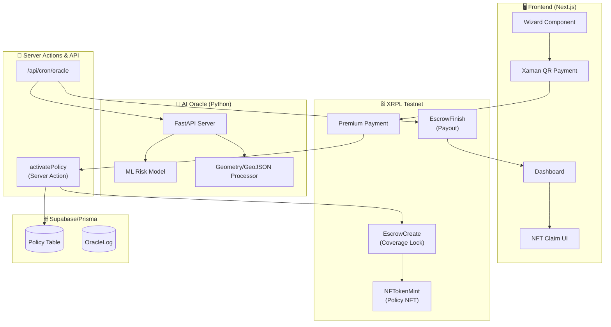
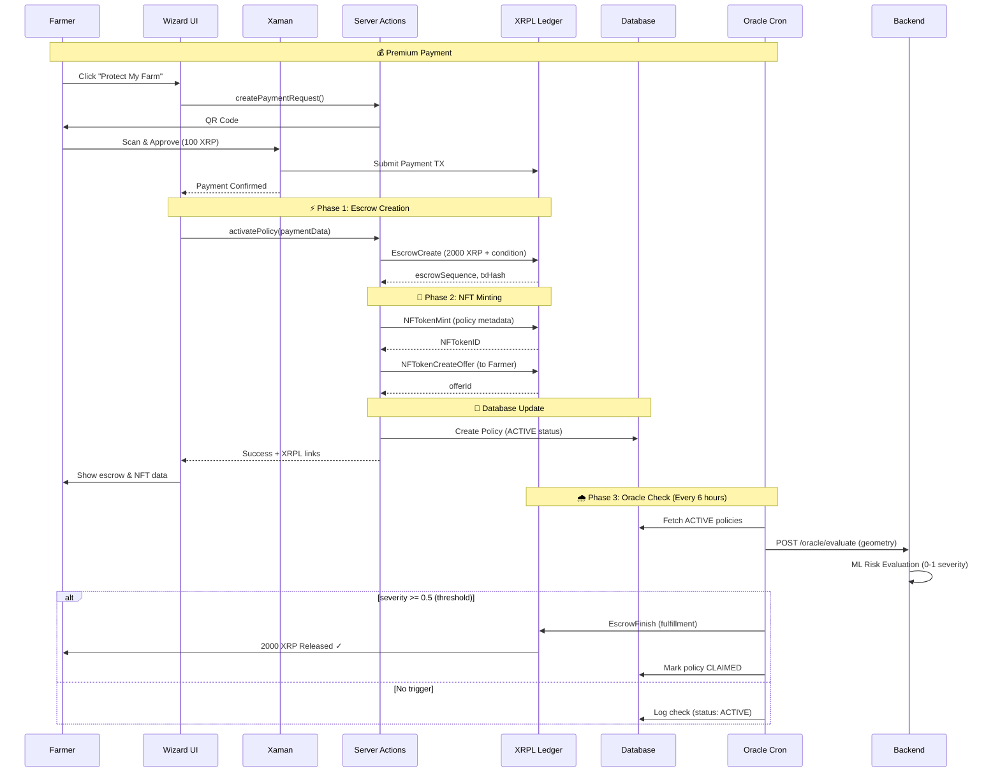
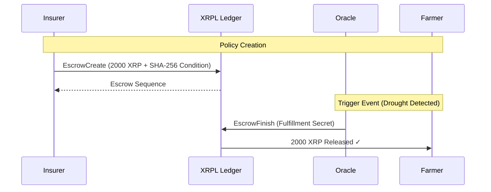
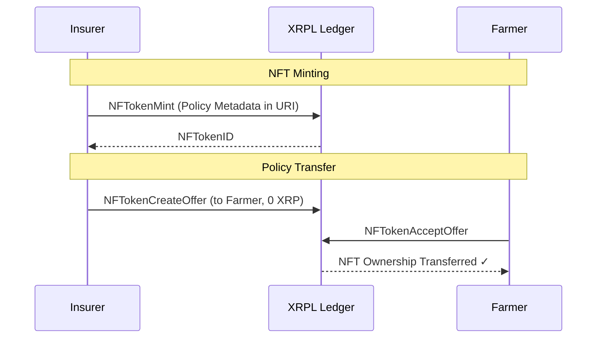
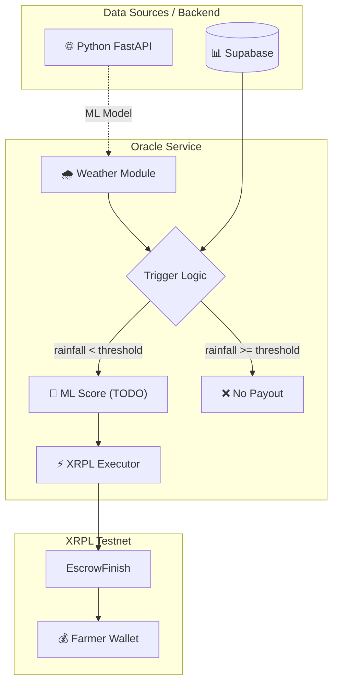
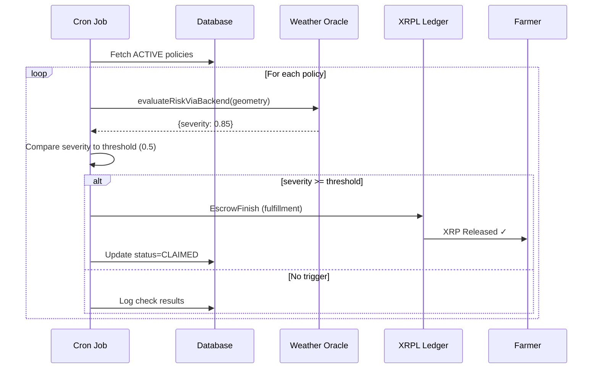
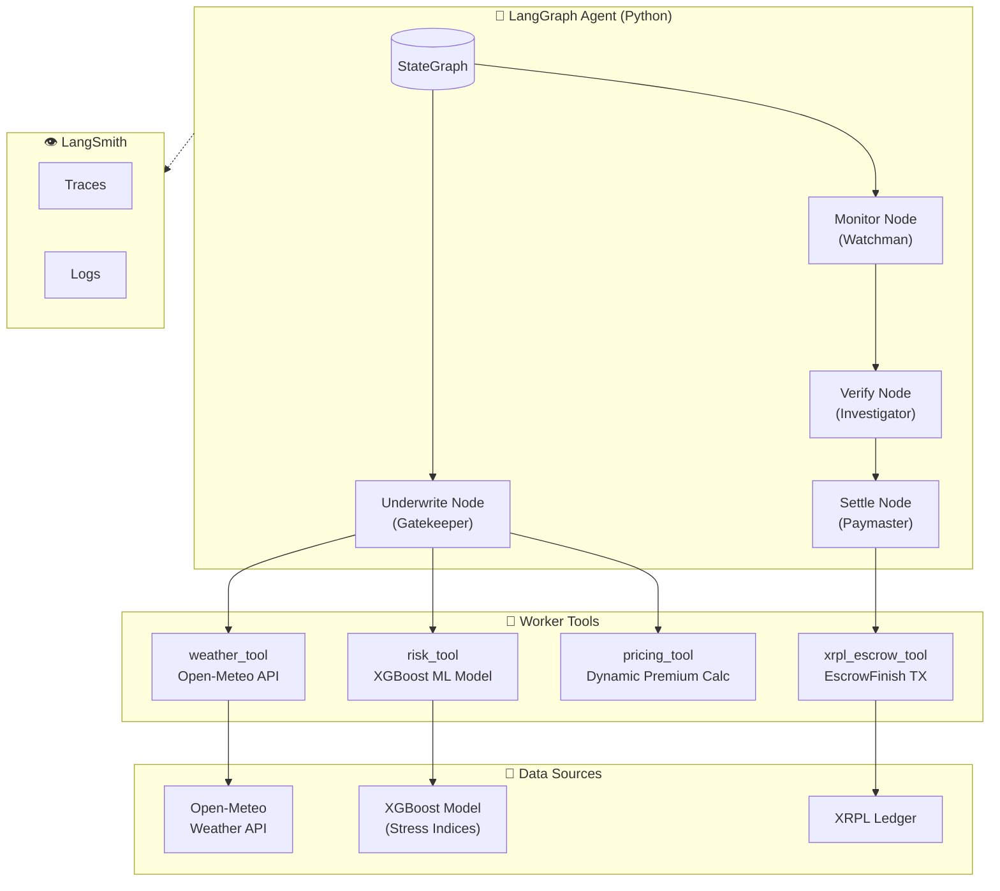
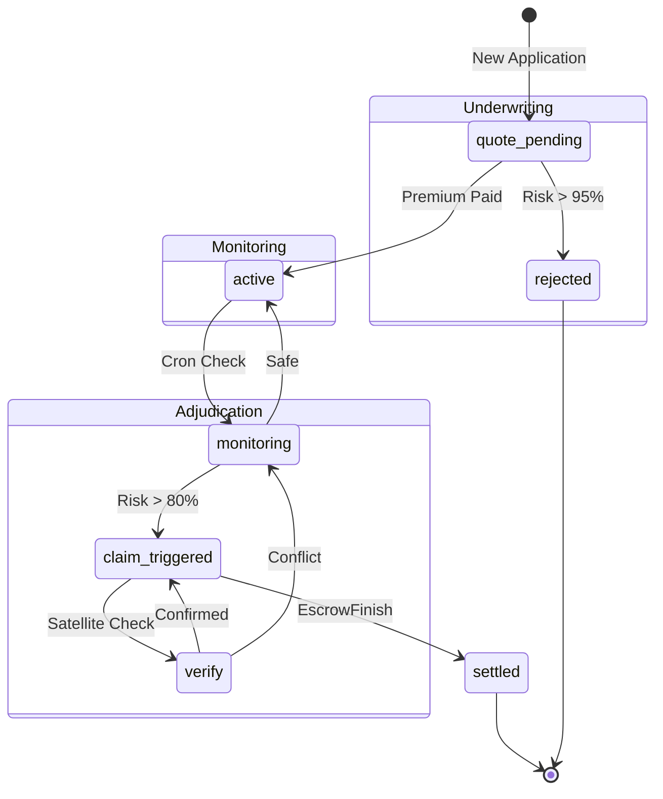

# Canopy

**Insurance That Pays Automatically.**
Canopy is a decentralized agricultural insurance platform built on the XRPL blockchain. It uses parametric triggers and real-time weather oracles to provide instant liquidity to farmers, removing claims, disputes, and delays.

## Core Features

* **Data-Driven Triggers:** Policies activated by objective NOAA/NASA weather data.
* **Instant Payouts:** Smart contracts on XRPL Escrow release funds immediately.
* **Total Transparency:** Audited on-chain logic ensures guaranteed liquidity.

---

## Complete System Architecture

The Canopy platform consists of three integrated phases that work together to provide end-to-end automated insurance:



### End-to-End Flow



---

## Design System

* **Theme:** Premium Startup Aesthetic (Dark Mode, Deep Forest Void, Neon Cyber Lime).
* **Documentation:**
  * [design.md](./design.md): Full semantic design system and Stitch prompts.
  * [site.md](./site.md): Complete functional specification for the site and app.

## Agent Skills & Workflows

This project is equipped with specialized AI agent skills and workflows to accelerate development.

### Skills (`.agents/skills`)

Usage: These are "folders of instructions" the agent can use to perform complex tasks.

| Skill Name | Description | When to Use |
| :--- | :--- | :--- |
| **blockchain-developer** | Builds production-ready Web3 applications and smart contracts. | Use for XRPL integration, escrow logic, NFT minting. |
| **prisma-expert** | Prisma ORM expert for schema design and migrations. | Use for database schema updates and queries. |
| **react-components** | Generates React components. | Use when converting a design into functional React code. |

### Workflows (`.agent/workflows`)

Usage: These are step-by-step guides for specific technical implementations.

| Workflow Name | Description | When to Use |
| :--- | :--- | :--- |
| **nextauth-js** | Sets up NextAuth.js authentication. | Use when implementing user authentication (OAuth, Email, Credentials). |
| **supabase-rls** | Configures Supabase Row Level Security. | Use when setting up database permissions and security rules. |

---

## Phase 1: Parametric Escrow Core

The "Lock-and-Trigger" lifecycle for agriculture insurance is implemented on XRPL Testnet.

### Phase 1 Architecture



### Phase 1 Workflow

1. **EscrowCreate Transaction**
   * Insurer locks coverage amount (e.g., 2000 XRP = 20x premium)
   * Includes SHA-256 crypto-condition (hash of secret fulfillment)
   * Specifies Farmer as destination wallet
   * Sets `FinishAfter` timestamp for minimum hold period

2. **Crypto-Condition**
   * Uses `five-bells-condition` library (PREIMAGE-SHA-256)
   * 32-byte random preimage generates condition/fulfillment pair
   * Only the Oracle holds the fulfillment secret
   * Escrow cannot be released without correct fulfillment

3. **EscrowFinish Transaction**
   * Oracle submits fulfillment when weather threshold met
   * XRPL validates fulfillment against stored condition
   * Funds released atomically to Farmer's wallet

### Testnet Wallets

Configure in `.env`:

```bash
XRPL_INSURER_SEED=sXXX...  # Locks coverage XRP
XRPL_FARMER_SEED=sXXX...   # Receives payout
XRPL_ORACLE_SEED=sXXX...   # Triggers release
INSURER_WALLET_ADDRESS=rXXX...  # For EscrowFinish Owner field
```

### Phase 1 Key Files

| File | Purpose |
|------|---------|
| `src/lib/xrpl/escrow-create.ts` | Creates escrow with crypto-condition |
| `src/lib/xrpl/escrow-finish.ts` | Oracle releases locked XRP |
| `src/lib/xrpl/policy-activation.ts` | Orchestrates full Phase 1+2 flow |
| `scripts/verify-phase1.ts` | End-to-end test script |

### Run Verification

```bash
# Ensure Insurer has >2100 XRP for escrow + fees
npx tsx scripts/verify-phase1.ts
```

Expected output: Farmer balance increases by 2000 XRP.

---

## Phase 2: Policy NFT Tokenization

XLS-20 NFTs that store parametric policy data with transferability enabled.

### Phase 2 Architecture



### Phase 2 Workflow

1. **NFTokenMint Transaction**
   * Insurer mints NFT with policy details in URI field
   * Metadata encoded as hex-JSON (compact format for 256-byte limit)
   * `tfTransferable` flag enables secondary market trading
   * NFTokenTaxon=1 identifies as policy category

2. **Metadata Schema (Compact)**

   ```json
   {
     "t": "Corn Drought Protection",
     "la": 36.7783, "lo": -119.4179,
     "th": "Rainfall < 10mm",
     "p": "2000000000",
     "es": 14630109
   }
   ```

   | Field | Description |
   |-------|-------------|
   | `t` | Policy type/title |
   | `la`, `lo` | Latitude, Longitude |
   | `th` | Weather threshold |
   | `p` | Payout amount (drops) |
   | `es` | Linked escrow sequence |

3. **NFTokenCreateOffer**
   * Creates sell offer to Farmer at 0 XRP (free transfer)
   * Farmer can claim NFT via NFTokenAcceptOffer
   * NFT proves policy ownership and terms

### Phase 2 Key Files

| File | Purpose |
|------|---------|
| `src/lib/xrpl/nft-types.ts` | PolicyNFTMetadata interface |
| `src/lib/xrpl/nft-mint.ts` | Hex encoding + NFT utilities |
| `scripts/verify-phase2.ts` | End-to-end NFT test |

### Run Verification

```bash
npx tsx scripts/verify-phase2.ts
```

Expected output: NFT minted, transferred to Farmer, metadata decoded.

---

## Phase 3: Oracle Signer Service

Automated weather monitoring and escrow trigger system with modular design.

### Phase 3 Architecture



### Trigger Flow



### Phase 3 Workflow

1. **Cron Job Endpoint** (`/api/cron/oracle`)
   * Protected by `CRON_SECRET` header
   * Fetches all ACTIVE policies with escrow data
   * Checks weather for each policy's coordinates
   * Triggers EscrowFinish when threshold met

2. **Mock Weather (Development)**
   * Returns simulated drought: 2mm rainfall
   * Below typical 10mm threshold = always triggers
   * Replace with OpenWeather API for production

3. **Policy Status Updates**
   * ACTIVE → CLAIMED on successful payout
   * claimTxHash records EscrowFinish transaction
   * OracleLog tracks all weather checks

### Phase 3 Key Files

| File | Purpose |
|------|---------|
| `src/app/api/cron/oracle/route.ts` | Cron endpoint for oracle checks |
| `src/lib/oracle/weather-oracle.ts` | Mock weather + OpenWeather TODO |
| `src/lib/oracle/OracleService.ts` | Main orchestration + ML TODO |
| `scripts/test-trigger.ts` | End-to-end oracle test |

### Run Oracle Manually

```bash
# Development (no auth required)
curl -X POST http://localhost:3000/api/cron/oracle

# Production (with auth)
curl -X POST http://localhost:3000/api/cron/oracle \
  -H "Authorization: Bearer YOUR_CRON_SECRET"
```

Expected output: Oracle triggers payout when rainfall < threshold.

### TODO Placeholders

* **OpenWeather API** - Replace mock with real weather data
* **ML Score** - Add probability scoring for edge cases
* **Real Cron** - Set up Vercel Cron or external scheduler

---

## Phase 4: AI Agent ("The Guardian")

A LangGraph-powered autonomous agent that orchestrates underwriting, monitoring, and claims adjudication.

### Phase 4 Architecture



### State Machine Flow



### Phase 4 Workflow

1. **Underwrite Node (Gatekeeper)**
   * Fetches 7-day weather forecast via `weather_tool`
   * Runs risk assessment via `risk_tool` (uses OracleService + XGBoost)
   * Calculates dynamic premium: `Premium = (Coverage × 5%) × (1 + RiskScore) × Volatility`
   * Rejects policies with CRITICAL risk (>85%) - cannot insure active disasters

2. **Monitor Node (Watchman)**
   * Periodic checks on active policies (cron-triggered)
   * Compares current conditions against trigger thresholds
   * Escalates to verification when risk score exceeds 80%

3. **Verify Node (Investigator)**
   * Cross-references weather data with satellite imagery (TODO)
   * Resolves conflicts between data sources
   * "Physics beats Model" - hard data overrides ML predictions

4. **Settle Node (Paymaster)**
   * Executes `EscrowFinish` transaction on XRPL
   * Releases locked XRP to farmer's wallet
   * Logs audit trail with confidence score

### System Prompt ("The Guardian")

The agent operates under strict principles:

```
Core Principles:
1. Solvency First - Never insure already-materialized risks
2. Data Consensus - Satellite/Physics > ML Model when in conflict
3. Transparency - Every decision requires plain English reasoning

Data Weighting:
- XGBoost Model (Medium) → Baseline probability
- Open-Meteo/NASA (CRITICAL) → Hard physics override
- Satellite (HIGH) → Tie-breaker verification
```

### API Endpoints

| Endpoint | Method | Description |
| :--- | :--- | :--- |
| `/agent/quote` | POST | Generate insurance quote with dynamic pricing |
| `/agent/monitor` | POST | Check policy status and trigger conditions |
| `/agent/settle` | POST | Execute policy settlement on XRPL |
| `/agent/chat` | POST | Interactive assistant for users |
| `/agent/check-land` | POST | Verify if usage is agricultural |
| `/agent/audit-log` | GET | Retrieve natural language decision history |

**Quote Request:**

```json
{
  "latitude": 40.0,
  "longitude": -80.0,
  "farm_size_hectares": 50,
  "crop_type": "corn",
  "coverage_xrp": 1000
}
```

**Quote Response:**

```json
{
  "status": "quote_pending",
  "premium_xrp": 105.5,
  "risk_score": 0.42,
  "risk_level": "MEDIUM",
  "reasoning_log": [
    "✅ Quote generated: 105.5 XRP for 1000 XRP coverage.",
    "   Risk: MEDIUM (42.00%), Volatility: 1.15x"
  ]
}
```

### Phase 4 Key Files

| File | Purpose |
| :--- | :--- |
| `backend/agent/graph.py` | LangGraph StateGraph definition |
| `backend/agent/tools.py` | Worker tools (Weather, Risk, Pricing, XRPL) |
| `backend/agent/prompts.py` | System prompt for "The Guardian" persona |
| `backend/main.py` | FastAPI endpoints (`/agent/*`) |

### Environment Variables

```bash
# LangSmith Observability (Optional)
LANGCHAIN_TRACING_V2=true
LANGCHAIN_API_KEY=lsv2_...
LANGCHAIN_PROJECT="canopy-agent"

# OpenAI (for LLM reasoning)
OPENAI_API_KEY=sk-...
```

### Run Agent Locally

```bash
cd backend
pip install -r requirements.txt

# Start FastAPI server
uvicorn main:app --reload --port 8000

# Test quote endpoint
curl -X POST http://localhost:8000/agent/quote \
  -H "Content-Type: application/json" \
  -d '{"latitude": 40.0, "longitude": -80.0, "farm_size_hectares": 50, "crop_type": "corn", "coverage_xrp": 1000}'
```

---

## Server Actions & API

### Policy Activation (Server Action)

```typescript
// src/app/actions/payment.ts
activatePolicy(data: ActivatePolicyData)
```

Orchestrates full XRPL policy lifecycle after premium payment.

**Input Data:**

```typescript
{
  premiumAmount: 100,
  crop: "corn",
  riskLevel: 10,
  coordinates: { lat: 36.7783, lng: -119.4179 },
  areaHectares: 50,
  premiumTxHash: "ABC123..."
}
```

**Response:**

```jsonjson
{
  "success": true,
  "policyId": "clxyz123...",
  "coverageAmount": 2000,
  "escrow": {
    "sequence": 14630109,
    "txHash": "DEF456...",
    "explorerUrl": "https://testnet.xrpl.org/transactions/DEF456"
  },
  "nft": {
    "tokenId": "000800...",
    "mintTxHash": "GHI789...",
    "explorerUrl": "https://testnet.xrpl.org/nft/000800"
  }
}
```

### Oracle Trigger

```http
POST /api/cron/oracle
Authorization: Bearer {CRON_SECRET}
```

Checks all active policies and triggers payouts.

**Response:**

```json
{
  "success": true,
  "timestamp": "2024-02-06T05:00:00Z",
  "processed": 5,
  "triggered": 2,
  "results": [
    {
      "policyId": "clxyz123...",
      "triggered": true,
      "reason": "Rainfall 2mm < 10mm threshold",
      "txHash": "JKL012..."
    }
  ]
}
```

---

## Environment Variables

```bash
# Database
DATABASE_URL="postgresql://..."
DIRECT_URL="postgresql://..."

# XRPL Testnet Wallets
XRPL_INSURER_SEED="sXXX..."      # Locks coverage XRP
XRPL_FARMER_SEED="sXXX..."       # Receives payout
XRPL_ORACLE_SEED="sXXX..."       # Triggers release
INSURER_WALLET_ADDRESS="rXXX..." # For EscrowFinish

# Supabase
NEXT_PUBLIC_SUPABASE_URL="https://xxx.supabase.co"
NEXT_PUBLIC_SUPABASE_ANON_KEY="sb_publishable_..."
SUPABASE_SERVICE_ROLE_KEY="sb_secret_..."
SUPABASE_JWT_SECRET="xxx-xxx-xxx"

# Xaman (Xumm)
XUMM_API_KEY="xxx-xxx"
XUMM_API_SECRET="xxx-xxx"

# Oracle Cron
CRON_SECRET="your-secret-key"

# App
NEXT_PUBLIC_APP_URL="http://localhost:3000"
NEXT_PUBLIC_MAPBOX_TOKEN="pk.xxx..."
```

---

## Getting Started

### Prerequisites

* Node.js 18+
* pnpm (recommended)
* XRPL Testnet wallets with XRP (get test XRP from faucet)

### Installation

```bash
# Clone and install
git clone https://github.com/yourorg/xrp_farmer
cd xrp_farmer
pnpm install

# Set up environment
cp .env.example .env
# Edit .env with your credentials

# Run database migrations
pnpm prisma migrate dev

# Start development server
pnpm dev
```

### Verify XRPL Integration

```bash
# Test Phase 1: Escrow
npx tsx scripts/verify-phase1.ts

# Test Phase 2: NFT
npx tsx scripts/verify-phase2.ts

# Test Phase 3: Oracle
npx tsx scripts/test-trigger.ts
```

Open [http://localhost:3000](http://localhost:3000) with your browser to see the result.

---

## License

MIT License - See [LICENSE](./LICENSE) for details.
