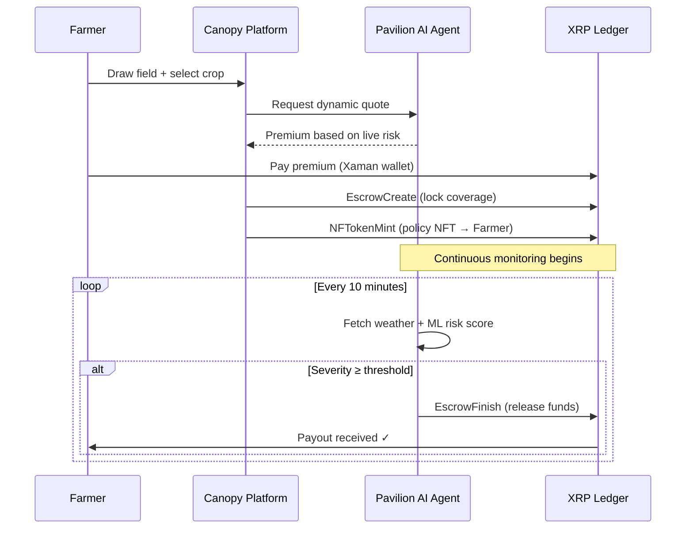
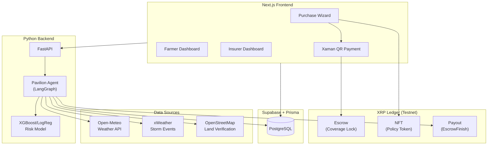
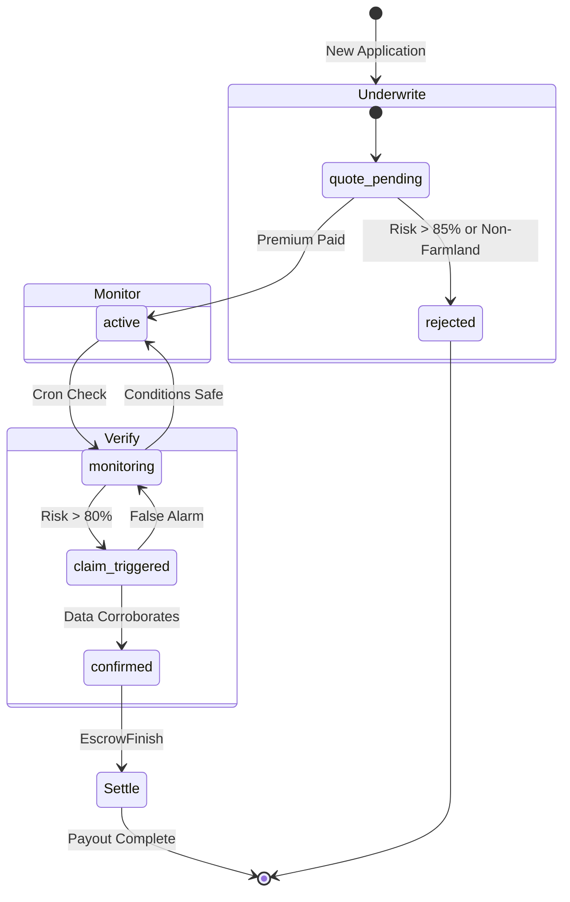

# 🌿 Canopy

### Crop insurance that pays automatically.

Canopy is a full-stack parametric agricultural insurance platform built on the **XRP Ledger**. Farmers draw their field on a satellite map, choose a crop, and pay a premium — coverage activates instantly as an on-chain escrow + NFT policy. An autonomous AI agent called **Pavilion** continuously monitors real-time weather data and, when conditions breach the trigger threshold, releases the payout directly to the farmer's wallet. No claims. No paperwork. No delays.

> **Built for CMU TartanHacks 2026** · Tracks: Ripple · Polychrome Mosaic · Community Mural

---

## The Problem

Traditional agricultural insurance is broken for small-scale farmers:

- **Slow** — Claims take weeks to months to process.
- **Opaque** — Payouts depend on subjective adjuster evaluations.
- **Inaccessible** — High overhead makes coverage uneconomical for small farms.
- **Disputed** — Farmers and insurers argue over whether damage really occurred.

## Our Solution

Canopy replaces the entire claims process with **objective data and code**:

| Traditional Insurance | Canopy |
| :--- | :--- |
| File a claim after damage | Automatic trigger from weather data |
| Wait weeks for an adjuster | AI agent evaluates in real time |
| Payout depends on negotiation | Payout is deterministic and on-chain |
| Paper policy in a filing cabinet | NFT policy on the XRP Ledger |

**If the weather hits the threshold, you get paid. Period.**

---

## How It Works

```
1. Map Your Field → 2. Choose Crop & Risk → 3. Pay Premium → 4. Get Protected
```



---

## Key Features

### 🗺️ Satellite Field Mapping
Farmers draw their exact field boundaries on a Mapbox satellite map. The polygon geometry is stored as GeoJSON and used by the oracle to sample weather conditions at multiple points across the field.

### 🤖 Pavilion — Autonomous AI Agent
A LangGraph-powered agent that manages the full insurance lifecycle through four phases:

| Phase | Role | What It Does |
| :--- | :--- | :--- |
| **Underwrite** | Gatekeeper | Verifies farmland via OSM, blocks active disasters, calculates dynamic premium |
| **Monitor** | Guardian | Fuses weather, storm events, and ML risk scores every 10 minutes |
| **Verify** | Investigator | Cross-references data sources; resolves conflicts with explicit reasoning |
| **Settle** | Paymaster | The only entity authorized to trigger EscrowFinish; logs full audit trail |

Pavilion uses an XGBoost/LogReg model trained on historical crop-failure data, Open-Meteo weather forecasts (precipitation, temperature, soil moisture, wind, UV, evapotranspiration), and xWeather severe-event alerts. Every decision is logged with a plain-English reasoning chain for full transparency.

### ⛓️ XRPL Escrow + NFT Policies
- **EscrowCreate** locks the coverage amount with a SHA-256 crypto-condition. Only the oracle's fulfillment secret can release funds.
- **NFTokenMint** (XLS-20) creates a transferable NFT containing compact policy metadata (crop, location, threshold, coverage, escrow link).
- **EscrowFinish** atomically releases funds to the farmer's wallet when triggered.

### 💸 Dynamic Pricing
Premiums are calculated in real time based on the 7-day weather forecast, crop type, regional storm activity, and ML risk score:

```
Premium = (Coverage × Base Rate) × (1 + Risk Score) × Volatility Factor
```

### 📊 Dual Dashboards
- **Farmer Dashboard** — Policy cards with status, weather widget, coverage overview, "distance to payout" gauge, oracle monitoring.
- **Insurer Dashboard** — Total value locked, active policy count, risk heatmap, liquidity manager, oracle console, force-trigger controls.

### 🔐 Wallet Authentication
Sign in with a Xaman (Xumm) wallet or email via Supabase Auth. Role-based access control separates Farmer, Insurer, and Admin views.

---

## Architecture



---

## Tech Stack

| Layer | Technology |
| :--- | :--- |
| **Frontend** | Next.js 16 (App Router), React, Tailwind CSS 4, Radix UI, Mapbox GL |
| **Blockchain** | xrpl.js, Xaman SDK, five-bells-condition (SHA-256 escrows) |
| **AI Agent** | LangGraph, LangChain, OpenAI GPT (with Gemini fallback) |
| **ML Model** | scikit-learn, XGBoost/LogReg (trained on 2020–2022 crop failure data) |
| **Backend** | FastAPI, Uvicorn, httpx |
| **Database** | PostgreSQL 15 (Supabase), Prisma ORM |
| **Auth** | Supabase Auth (wallet + email) |
| **Weather Data** | Open-Meteo (forecast + historical), xWeather (storm events) |
| **Maps** | Mapbox GL, Turf.js, Mapbox Draw + Geocoder |
| **Observability** | LangSmith (traces + logs) |
| **Deployment** | Vercel (frontend), Docker (backend), Vercel Cron |

---

## Pavilion AI Agent — Deep Dive

### State Machine



### Tools

| Tool | Source | Purpose |
| :--- | :--- | :--- |
| `weather_tool` | Open-Meteo | 7-day forecast: precipitation, temp, wind, UV, soil moisture, ET0 |
| `risk_tool` | XGBoost model | Crop-failure probability (0–1) based on weather features |
| `pricing_tool` | Internal | Dynamic premium with crop profiles + storm surcharge |
| `land_verification_tool` | OpenStreetMap | Confirms coordinates are on agricultural land |
| `storm_events_tool` | xWeather | Active severe weather alerts (tornado, hail, flood) |
| `xrpl_escrow_tool` | XRPL Testnet | Triggers EscrowFinish to release locked funds |
| `audit_log_tool` | Internal | Records plain-English reasoning + evidence hash |

### Core Principles

1. **Solvency First** — Never insure risks that have already materialized.
2. **Data Consensus** — When sources conflict, physics (satellite/weather) overrides the ML model.
3. **Transparency** — Every decision is logged with a structured Chain-of-Thought visible to insurers.

---

## Crop Support

| Crop | Weekly Rain Need | Heat Threshold | VPD Stress |
| :--- | :--- | :--- | :--- |
| 🌽 Corn | 45 mm | 35°C | 1.6 kPa |
| 🌾 Wheat | 35 mm | 30°C | 1.4 kPa |
| 🌱 Soy | 40 mm | 32°C | 1.5 kPa |

During monitoring, severity must reach **85% confidence** (0.85 consensus score) to trigger a payout — high enough to prevent false positives, low enough to ensure farmers get paid when they need it. Separately, applications with risk above 85% at underwriting time are rejected outright (you can't insure a disaster already in progress).

---

## Getting Started

### Prerequisites

- Node.js 18+, pnpm
- Python 3.9+
- Docker (optional, for local PostgreSQL)
- XRPL Testnet wallets ([faucet](https://xrpl.org/resources/dev-tools/xrp-faucets))

### Quick Start

```bash
# Clone the repo
git clone https://github.com/ianp-1/xrp_farmer
cd xrp_farmer

# Install frontend dependencies
pnpm install

# Set up environment
cp .env.example .env
# Fill in: Supabase, XRPL seeds, Xaman keys, Mapbox token

# Run database migrations
pnpm prisma migrate dev

# Start the frontend
pnpm dev
```

```bash
# In a second terminal — start the AI backend
cd backend
pip install -r requirements.txt
uvicorn main:app --reload --port 8000
```

Or use Docker Compose for the full stack:

```bash
docker compose up
```

Open [http://localhost:3000](http://localhost:3000) to see Canopy in action.

### Run Tests

```bash
# Frontend unit tests
pnpm test

# Backend agent tests
cd backend && python -m pytest tests/ -v

# XRPL integration verification
npx tsx scripts/verify-phase1.ts   # Escrow
npx tsx scripts/verify-phase2.ts   # NFT
npx tsx scripts/test-trigger.ts    # Oracle trigger
```

---

## Project Structure

```
├── src/
│   ├── app/                  # Next.js App Router
│   │   ├── actions/          # Server Actions (XRPL transactions)
│   │   ├── api/cron/oracle/  # Oracle cron endpoint
│   │   ├── dashboard/        # Farmer dashboard
│   │   ├── insurer/          # Insurer command center
│   │   ├── wizard/           # Policy purchase wizard
│   │   └── admin/            # Admin portal
│   ├── components/           # React components
│   └── lib/
│       ├── xrpl/             # Escrow, NFT, wallet utilities
│       └── oracle/           # Oracle service + weather logic
├── backend/
│   ├── agent/
│   │   ├── graph.py          # LangGraph state machine
│   │   ├── tools.py          # Agent tool functions
│   │   └── prompts.py        # System + phase-specific prompts
│   ├── main.py               # FastAPI endpoints
│   └── model_logreg_2020-2022.joblib  # Pre-trained ML model
├── prisma/
│   └── schema.prisma         # Database schema
└── tests/                    # Agent + integration tests
```

---

## Environment Variables

```bash
# Database (Supabase)
DATABASE_URL="postgresql://..."
DIRECT_URL="postgresql://..."

# XRPL Testnet Wallets
XRPL_INSURER_SEED="sXXX..."
XRPL_ORACLE_SEED="sXXX..."
INSURER_WALLET_ADDRESS="rXXX..."

# Supabase Auth
NEXT_PUBLIC_SUPABASE_URL="https://xxx.supabase.co"
NEXT_PUBLIC_SUPABASE_ANON_KEY="..."
SUPABASE_SERVICE_ROLE_KEY="..."

# Xaman Wallet
XUMM_API_KEY="..."
XUMM_API_SECRET="..."

# AI / LLM
OPENAI_API_KEY="sk-..."

# Maps & Cron
NEXT_PUBLIC_MAPBOX_TOKEN="pk...."
CRON_SECRET="..."
```

---

## License

MIT
